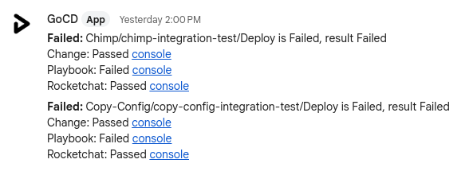
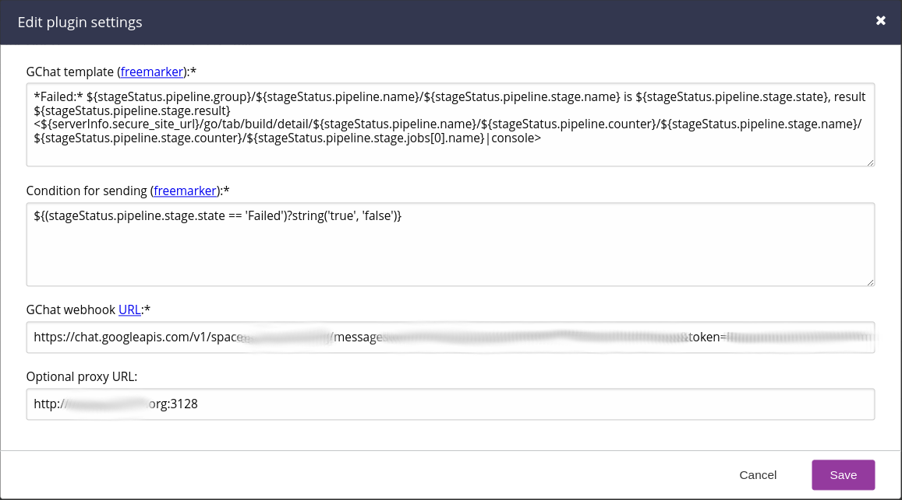

Go GChat Notifier Plugin
===================

[](https://github.com/1and1/go-gchat-notifier-plugin/actions/workflows/maven.yml)
[](https://github.com/1and1/go-gchat-notifier-plugin/releases)
[](https://github.com/1and1/go-gchat-notifier-plugin/releases)<!--- [](https://github.com/1and1/go-gchat-notifier-plugin/releases) -->
[](https://opensource.org/licenses/Apache-2.0)

A GoCD notification plugin for the
[GoCD](http://www.go.cd/) continuous integration server.

A chat message can look like this:



The plugin is very customizable by using the
template language
[Apache Freemarker](https://freemarker.apache.org/index.html)
as an approach to formulate

* the condition when to send messages.
* the chat message body themselves.

### Requirements

The go-gchat-notifier-plugin requires at least the following environment:

* [Google workspace](https://en.wikipedia.org/wiki/Google_Workspace) account so you can create GChat webhooks
* GoCD 18.9.0 and later
* JDK 8 and later (the JDK GoCD is running with)

### Installation

Download [`go-gchat-notifier-plugin.jar`](https://github.com/1and1/go-gchat-notifier-plugin/releases) into the `plugins/external` directory of your GoCD server and restart it.

You can also download a signed jar from the [maven repository](https://repo1.maven.org/maven2/com/oneandone/go-gchat-notifier/) and verify the GPG signature with my [GPG public key](https://github.com/sfuhrm.gpg).

#### Getting a GChat webhook URL

At the moment the plugin works only with GChat webhook URLs.
Webhook URLs can as far as I know only be generated by Google
workspace customers, not individuals.

To generate a GChat webhook URL

* go to an existing space in GChat,
* go the the space menu right besides the space
name,
* click 'Apps & integrations' menu,
* click 'Manage webhooks',
* add a new webhook name, provide an optional avatar URL and press 'Save'.
* a webhook URL will be generated for you.

At the moment, the tokens look like this:

`https://chat.googleapis.com/v1/spaces/.../messages?key=...&token=...`

See also [Google Workspace documentation](https://developers.google.com/chat/how-tos/webhooks#create_a_webhook).

### Configuration

The following is a screenshot of the configuration dialogue of version 0.5.0:



The following configuration items exist in the plugin:

* GChat template (freemarker):* A
  [freemarker format](https://freemarker.apache.org/docs/dgui_template_overallstructure.html) template
  for the chat message body. The template has access
  to the following objects:
  * `stageStatus`: The original stage status request from the
    GoCD server. Can be used to render some information
    about the pipeline.
  * `serverInfo`: The server info object that contains the
    servers address(es). Can be used to render some
    URLs towards the console.
* Condition for sending (freemarker):* A freemarker format template
  that either needs to render to the String `true` or
  `false` to decide whether to send a message (`true`)
  or not (`false`).
* GChat webhook URL:* The mandatory GChat
  space webhook URL to send messages to. Please see
  'Getting a GChat webhook URL' on how to get a webhook.
* Optional proxy URL: An optional HTTP proxy URL to use
  for sending traffic to GChat. At the moment only the
  URL can be provided, there is no separate way
  for configuring user/password authentication.

### Sample Configuration

In the following is a usable sample for a configuration.
The configuration only notifies on stage states which are in
state 'Failed´ and sends a chat message that has a
direct deep link into your GoCD instances console of the
stage run.

#### GChat template (freemarker)

```text
*Failed:* ${stageStatus.pipeline.group}/${stageStatus.pipeline.name}/${stageStatus.pipeline.stage.name} is ${stageStatus.pipeline.stage.state}, result ${stageStatus.pipeline.stage.result}
<${serverInfo.secure_site_url}/go/tab/build/detail/${stageStatus.pipeline.name}/${stageStatus.pipeline.counter}/${stageStatus.pipeline.stage.name}/${stageStatus.pipeline.stage.counter}/${stageStatus.pipeline.stage.jobs[0].name}|console>
```

#### Condition for sending (freemarker)

```text
${(stageStatus.pipeline.stage.state == 'Failed')?string('true', 'false')}
```
